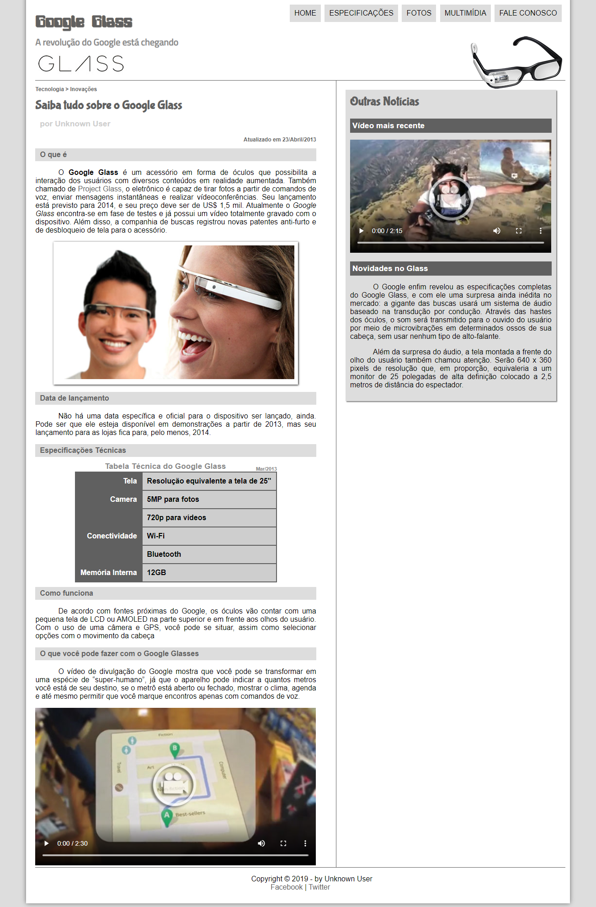

# [HTML5 / CSS3](https://www.youtube.com/watch?v=epDCjksKMok&list=PLHz_AreHm4dlAnJ_jJtV29RFxnPHDuk9o)

###### Cursos que o professor Gustavo Guanabara guia e assim leciona no canal [Curso em Vídeo](https://www.youtube.com/user/cursosemvideo).

---

  
